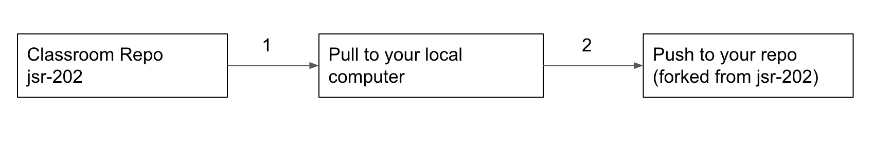
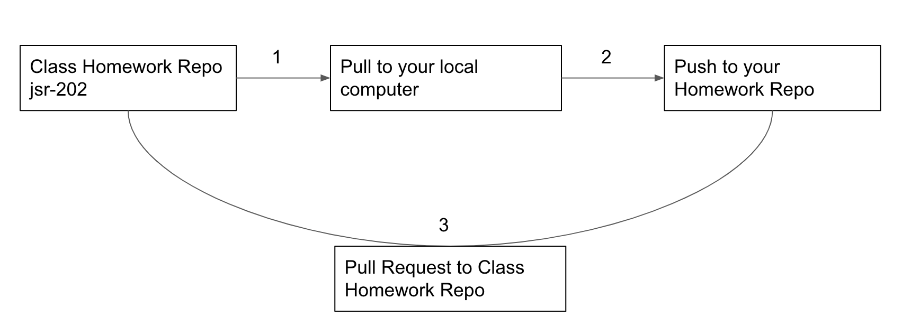

#  Command line

| Timing | Type |Topic|
| --- | --- | --- |
| 20 min | [Opening](#opening) | JavaScript & Web Technology |
| 40 min | [Codealong](#codealong1) | Introduction to the Terminal|
| 55 min | [Codealong](#codealong2)  | Introduction to Git/GitHub  |
| 30 min | [Codealong](#codealong3)  | JS in the Terminal with Node |
| 10 min | [Conclusion](#conclusion)| Final Questions & Exit Tickets |

### Learning Objectives

- Use the most common commands to navigate and modify files / directories via the terminal window.
- Initialize a local Git repository and push/pull changes to a remote Git repository.
- Run basic JavaScript script on the command line using Node.

### Preparation
*Before this lesson, students should already be able to:*

- Installing and configuring Node.js, npm, Git, and other command line tools.
- Writing pseudocode and think programmatically.
- Using HTML and CSS to create static Web pages.

---
<a name="opening"></a>
## JS & Web Tech

#### What Can JavaScript Do?

* JavaScript is used mostly to add interactive elements like animations, buttons, and user input forms to the front-end. Increasingly, however, it is also being used to interact with APIs and databases and to perform back-end tasks.
* JavaScript has very few steps to run. You can add Javascript directly to HTML and it will run in your browser. You can also run Javascript in node.js by giving it a file containing your code.
* JavaScript works on users’ computers even when they are offline.
* JavaScript allows you to create highly responsive interfaces that improve the user experience and provide dynamic functionality, without the need to wait for the server to react and show another page.
* JavaScript can load content into the document if and when the user needs it, without the need to reload the entire page. This is commonly referred to as Ajax.
* JavaScript can determine your browser’s functional limitations and react accordingly. This is referred to as principles of _unobtrusive JavaScript_, or _progressive enhancement_.
* JavaScript can power website backends, scripts, and even physical devices thanks to node.js

#### The Downside of JavaScript

* JavaScript can be functionally flaky because the environment in which it operates is unknown: You don’t know the capabilities of computer on the receiving end of your Web page, you don’t know how busy the computer is with other functions, and you don’t know if JavaScript open in another tab of the browser is affecting the computer’s functionality.
* JavaScript (or some of its functions) is occasionally turned off in browsers for security purposes or because it is often used for annoying pop-windows or intrusive advertising.

Citation: [W3C](https://www.w3.org/community/Webed/wiki/What_can_you_do_with_JavaScript)

#### Node.js

We will be using node.js to interpret JS code in the class. Here's a bit more about Node.js.

The makers of Node.js made JavaScript (which normally runs only in the browser) available on the server side (and on your computer!). This allows you to build fast, scalable APIs and sites in JavaScript. JavaScript is already immensely popular; being able to use it on the back-end adds the option of using a single programming language throughout an entire full-stack application.

All this is helpful to engineers because it results in less context switching. Switching between JavaScript, HTML, CSS, and a back-end language (Ruby, Python, PHP, Java, etc.) is time consuming. Using a single language increases efficiency by cutting out all the back and forth.

Additionally, Javascript is designed to be event-driven and asynchronous. While other languages can perform only one task at a time, Javascript can send nearly everything to the background and keeps going.

Imagine a newspaper delivery boy stopping at each house, throwing the paper on the doorstep, and waiting to make sure the person comes out to pick it up before he moves on to the next house. That’s what we call blocking: each line of code finishes before moving on to the next line of code.

Think of it this way: A paperboy throws a newspaper on your porch and immediately moves on to the next house, and so on. By the time you pick your paper, he’s already  several houses up the street. This is non-blocking, or asynchronous—and it’s what makes Node so powerful.


#### Frameworks

* As with all programming languages, several frameworks and libraries are available that extend JavaScript's native capabilities. In this class, we won't be using frameworks. We will however be learning a popular JS libarary, jQuery, and a templating engine called Handlebars.

* Recent years have seen the development of frameworks that brings the MVC (Model View Controller) concept from back-end languages to front-end JavaScript. Angular, React, Vue, Ember, and Backbone are some of the more popular ones.

* These frameworks are very powerful; they're also highly complex and technical. In order to leverage these  frameworks, you will need to have to have a solid working knowledge of the fundamentals of JavaScript, APIs, the DOM, and the browser. The majority of this class will focus on these fundamentals; as the class proceeds, we will  introduce you to more advanced frameworks and concepts like the MVC model.

* The world of frameworks is evolving at a rapid pace. More important than knowledge of any one framework is an ability to learn new tools quickly. The JavaScript skills you learn in this class will provide the foundation you need to work with any framework or library more easily.

---
<a name="codealong1"></a>

## Introduction to the Terminal

We learned how to execute some scripts on the command line during Installfest. You will soon find that the command line is the heart of your operating system. Almost anything you can do from a GUI (Graphical User Interface), you can also do from the command line, but FASTER! We'll learn how to navigate computer files and folders using the terminal; this will help us begin pushing our projects to GitHub.  

#### Command Line Basics

Here are some important UNIX commands to know as you're working on the terminal.


| Command | Description | Command| Description |
| --- | --- | --- | --- |
| `ls` | **L**i**s**t the contents of the directory | `subl`/`code` | Open sublime/VScode text|
| `cd` | **C**hange **d**irectories| `pwd`| **P**rint **w**orking **d**irectory |
| `mkdir` | **M**a**k**e **dir**ectory | `say`| Make your computer talk |
| `rmdir` | **R**e**m**ove empty **dir**ectories  | `open`| Open a particular file in their default application|
| `rm` | **R**e**m**ove files or directories | `./`  | The current folder|
| `touch` | Create an empty file | `../`| One folder above your current working directory
| `echo` | Return a string |  `~/` | The home folder  |

#### Command Line Codealong

**For Macs**:
  * Open the "Terminal" app (Applications > Utilities > Terminal)

**For Windows**:
 * Open the "Command Prompt" application.
 * [Git Bash](https://gitforwindows.org/) will allow for the same Unix commands that Mac users are using


**Get familiar with the basic commands on the terminal!**


1.  Navigate to your Documents Folder from your Root Directory. ```cd ~``` and then ```cd Documents```

2. Create a directory named Advanced_JS.  ```mkdir Advanced_JS```

3. Change into this directory. ```cd Advanced_JS```

4. Create a file named "index.html" using the touch command. ```touch index.html``` Windows: ```type nul > filename.txt```

5. Demonstrate how to open "index.html" in Sublime Text or VS Code from the terminal. ```subl``` or ```code``` 

6. Have students set up their code editor for their working environment. (Show them the open files side bar.)

7. Using HTML comments, type "This is how you should take notes in class." Some students will need a refresher on how to write HTML comments (i.e., `<!-- comment -->`)

8. Create an empty directory within the Advanced JS folder and remove it. ```mkdir test_folder ``` and ```rmdir test_folder ```

#### More Independent Practice

Complete the following instructions below in the Terminal application.

1. Create a folder in your `~/Sites/` folder titled `goals`.

2. Once inside that folder, create three empty files:
  - goals.html
  - worries.html
  - index.html

3. Open your text editor, click File > Open and navigate to your newly created `~/Sites/goals` folder.
In the respective files (goals.html and worries.html), write your top three goals and top three worries for this course.

4. Paste the following contents into index.html:

  ```javascript
  <html>
  <head></head>
  <body>
    <a href="goals.html"></a>
    <br>
    <a href="worries.html"></a>
  </body>
  </html>
  ```

5. Open index.html with your browser and make sure you see your goals and worries. Double click the file from Finder/File Explorer or drag the file into your web browser. 

---

<a name="codealong2"></a>
## Introduction to Git/GitHub

#### What is Git?

Git is a tool that:
* Primarily stores code, but can also store files, like Dropbox or Google Drive
* Maintains each file’s history, including all document changes (like Apple's Time Machine software)
* Is now commonplace in any company that employs engineers

#### Why is Git So Popular with Developers?

* Because Git stores a history of the code, it allows developers to “go back in time” if something breaks
* Git tracks changes so you can see who worked on what

#### What is GitHub?
GitHub is a platform that:
* Facilitates the sharing and managing of code, making it easy for multiple engineers to collaborate on the same project.
* Hosts files on the Web so you can share the finished product with other people

We setup our GitHub account and _SSH Key_ in the last lesson.

#### Why is GitHub So Popular with Developers?

* Much like Dropbox or Google Drive lets multiple people collaborate on the same document; GitHub allows this for code
* GitHub allows team members to provide feedback on the code, which potentially increases code quality

#### How Does GitHub Work in a Collaborative Environment?

GitHub's collaborative process can work many different ways, but this is the most common:

1. Each GitHub project has a Git _repository_, or _repo_. Engineers joining a team start by "cloning" the repo. That is, they copy the Git repo from GitHub's cloud and save it in a local folder.
2. The main, stable version of the codebase is on the default "branch" in Git, which is called `master`.
- Engineers typically create new branches for certain features or portions of the code they will work on
3. As engineers work on a project, they "add" and "commit" their changes. This establishes a saved version of a project and creates a history of the previous iteration. With these saved versions, engineers are able to revert to an earlier version if an issue arises that cannot be fixed.
4. If multiple engineers are working on a project, other engineers can review the committed code and provide feedback. For this class, the instructors will be reviewing and providing feedback on your code.
- We will be working with our own default `master` branch for each of our projects.

#### Git/GitHub Vocabulary

* **Git** - A version control program that saves the state of your project's files and folders; It takes a "snapshot" of what all your files look like at that moment and stores a reference to that "snapshot".

* **Repository** - A central location in which data—typically project-related—is stored and managed
* **Clone** - To download data from the cloud to your local machine (laptop, computer, etc.)
* **Commit** - To save a version of your project to Git

#### Class Git/GitHub Setup

1. We will be using a GitHub repository for our class materials and schedule located [here](https://git.generalassemb.ly/kyleta/jsr-202)
2. The way we want to set this up is going to be git practice in itself. Lets start by forking the repository. The fork button is located in the top right of the repository page.
3. Once it is forked, you will notice you now have a copy of the repository in your account. Clone the forked repository so you have a copy of the files on your local computer. Click the green drop down button labeled "Code." Copy the link provided.
4. Go over to your terminal and navigate to the folder you would like to place this repository in. Then to clone the repository, type this command with the link replaced as the one you copied from your repository:
```bash
$ git clone https://git.generalassemb.ly/<USERNAME>/jsr-202.git
```
5. Next we want to set the upstream to the class repository. We do this so that we pull the lastest work and lessons from class repository.
```bash
$ git remote add upstream https://git.generalassemb.ly/kyleta/jsr-202.git
```
6. When you need to pull down new changes from the class repository, you want to tell git correctly from where so we type in `git pull` with the location of `upstream master`
```bash
$ git pull upstream master
```
7. If the merge is successful, you will get a message with something like: "Please enter a commit message to explain why this merge is necessary, especially if it merges an updated upstream into a topic branch." If you would like, youre welcome to write a message. How to do this, you would do theses steps (this also assumes your default terminal editor is vim):

    1. press "i" (i for insert)
    2. write your merge message
    3. press "esc" (escape)
    4. write ":wq" (write & quit)
    5. then press enter

If no message is needed, go ahead and just type `:qa`. A default message will be created

8. To push up work, we will do the same normal process of git which is add, commit and push
```
$ git add -A
$ git commit -m 'change has been made'
$ git push origin master
```



#### Homework Setup

1. Our submission for homework will be set up in a similar fashion to our class repository setup. Our homework repository will be located [here](https://git.generalassemb.ly/kyleta/jsr-202-hw). Once again we will want to fork this repository, clone it to your local computer, add the upstream, push up to your repository, and a new step will be submit a pull request to turn in your homework

2. The fork button is located in the top right of the repository page.
3. Click the green drop down button labeled "Code." Copy the link provided.
4. Go over to your terminal and navigate to the folder you would like to place this repository in. Then to clone the repository, type this command with the link replaced as the one you copied from your repository:
```bash
$ git clone https://git.generalassemb.ly/<USERNAME>/jsr-202-hw.git
```
5. Next we want to set the upstream to the class homework repository. We do this so that we pull the lastest homework assignments from class repository.
```bash
$ git remote add upstream https://git.generalassemb.ly/kyleta/jsr-202-hw.git
```
6. When you need to pull down new changes from the class repository, you want to tell git correctly from where so we type in `git pull` with the location of `upstream master`
```bash
$ git pull upstream master
```
7. If the merge is successful, you will get a message with something like: "Please enter a commit message to explain why this merge is necessary, especially if it merges an updated upstream into a topic branch." If you would like, youre welcome to write a message. How to do this, you would do theses steps (this also assumes your default terminal editor is vim):

    1. press "i" (i for insert)
    2. write your merge message
    3. press "esc" (escape)
    4. write ":wq" (write & quit)
    5. then press enter

If no message is needed, go ahead and just type `:qa`. A default message will be created

8. To push up work, we will do the same normal process of git which is add, commit and push
```
$ git add -A
$ git commit -m 'change has been made'
$ git push origin master
```
9. Here is where its a little different. To turn in your homework go to your repository on Github and click on the tab "Pull Request." Select "New Pull Request."
10. If there are differences between the class homework repository and your homework repository, you should see it there and the "Create Pull Request" button should be available.
11. Give it an appropriate title like "(YOUR NAME) Homework" and you are all set



### GitHub Exercise

In this codealong, students will create their first GitHub repository and push to it.

**Creating and pushing to your first repository**

1. Create a new repository on github.com titled "username.github.io" (where "username" is your GitHub username).
2. ```cd``` into your ```~/Sites``` folder.
3. Clone the repository (hint: GitHub tells you how to do this with Git clone ... on the newly created repository page).
4. Move the files from your "goals" folder from the previous exercise into your ```~/Sites/username.github.io``` folder.
  ```
  $ mv ./goals/* ./username.github.io/
  ```
5. ```cd``` into your ```~/Sites/username.github.io``` folder.
6. Add all files in the ```~/Sites/username.github.io``` folder to the Git stage.
  ```
  $ git add -A
  ```
7. Commit your changes in Git with the message "Initial commit."
  ```
  $ git commit -m 'Initial commit.'
  ```
8. Push your changes to GitHub and verify that the changes were received in the Web interface
  ```
  $ git push origin master
  ```
9. Go back to your git repository on GitHub. Go to Settings and scroll down to the GitHub Pages section. On the "Source" drop down, select "master branch." Now scroll back down once the page refreshes and there should be a link that looks something like this `https://pages.git.generalassemb.ly/kyleta/kyleta.github.io/`

**Reverting Pushes**

Sometimes we make mistakes on what we push up. To undo a commit and reset it back to a previous point, you want to follow these steps:
1. Run the `git log` to see the past commits you made
  ```bash
  $ git log
  commit a05f3da31a0efa5eb6a782a059538904803fdebe (HEAD -> master, origin/master)
  Author: kyle liu <kyle116@yahoo.com>
  Date:   Tue Jan 26 22:56:11 2021 -0800

      updates to readme

  commit bc6be75613873d9dee9b3f8d289ebbb1ed02bfe3
  Author: kyle liu <kyle116@yahoo.com>
  Date:   Tue Jan 26 22:51:48 2021 -0800

      update to readme for optional homework

  commit 828f8bece4979302388ba066e60e26b4f3d35363
  Author: kyle liu <kyle116@yahoo.com>
  Date:   Tue Jan 26 22:45:17 2021 -0800

      added lesson 0
  ```
2. Select the commit hash you would like to revert to and run:
  ```bash
  $ git reset --hard bc6be75613873d9dee9b3f8d289ebbb1ed02bfe3
  ```
3. Push up to your repository with the `-f` flag. `-f` is short for `-force` and can be harmful as it may erase code if you are not careful on what you select.
  ```bash
  $ git push -f origin master
  ```

**Git Warnings:**

If you happen to get this warning:
```
hint: Pulling without specifying how to reconcile divergent branches is
hint: discouraged. You can squelch this message by running one of the following
hint: commands sometime before your next pull:
hint: 
hint:   git config pull.rebase false  # merge (the default strategy)
hint:   git config pull.rebase true   # rebase
hint:   git config pull.ff only       # fast-forward only
hint: 
hint: You can replace "git config" with "git config --global" to set a default
hint: preference for all repositories. You can also pass --rebase, --no-rebase,
hint: or --ff-only on the command line to override the configured default per
hint: invocation.
```

You can simply run the command to stop seeing this warning:
```
git config pull.ff true
```
More on this here: https://stackoverflow.com/questions/62653114/how-to-deal-with-this-git-warning-pulling-without-specifying-how-to-reconcile


---

<a name="codealong3"></a>
## JS in the Terminal

You may be more familiar with JS in the browser, but in order to get used to working with the terminal—and thinking like a programmer—we’ll be using JS on the command line during the first unit of this class. Remember when we installed Node and npm? We'll be using these tools to make scripts run in the terminal.

### Executing a JS program: Codealong

Starting next class, we'll be creating our own JavaScript files and building out from it. Before we dive in, though, we need to explore the power of the terminal and run JavaScript inside of it.

The terminal is to a programmer what a Swiss Army knife is to a survivalist. It’s a multi-faceted tool that we will always be using to move our projects forward. And, for now, it helps us focus our learning. The computer has always had a text-only interface. Some of you may remember DOS or the early text-only games before complex graphical interfaces. The terminal is a tool from that era that professional developers still use every day.

#### Part 1: Write and execute some code in a file!

1. In your working directory, start the Node console by typing in ```node```. Once inside the node console, you can type `.editor` to enable a more friendly code editor.

2. Now we can type in some JavaScript and see what happens.
Let's start off with a classic programming exercise, printing 'Hello World'.

  ```javascript
  console.log('Hello World')
  ```

You should see Hello World printed. Underneath you will see that it outputs `undefined`. This means that after it has completed the output, there is no further value to return. We just wrote our first bit of Node / JavaScript!

3. Now we can take it to the next level. Let's drop in some variables:

  ```javascript
  var x = 5;
  var y = 2;
  ```

4. We can also print these variables to our console by typing ```console.log(x)```. We do not include quotes around variables like we do with 'Hello World'.

#### Part 2: Let's do some basic math!

  1. What happens if you do:

  `x + y`

  or

  `y * 4`

  2. We can even update the variable like this:

  `x = 9`

  3. Now if we add x and y together we get a different result.

  `x + y`

  4. While this is only the tip of the iceberg, it starts to lay the foundation for us in terms of what we will be able to accomplish in the near future.

  To exit the console hit CTRL + c + c.

---
<a name="conclusion"></a>
## Conclusion

#### Review

Make sure the lesson objectives have been met.

* Understand what GitHub does and why we'll be using it.
* Understand how we will be using Node in the class.

#### The Developer Mentality

Here are some tips that you'll want to keep in mind as you continue coding!

  * Choose the right OS, editors and tools for your projects. Remember to do your research.
  * Leverage the online community's vast libraries and documentation.
  * Be efficient: Use the keyboard as much as possible instead of the mouse.
  * If you find yourself doing the same thing repeatedly, automate it.

#### Further Resources
* [Javascript Variable Declarations](https://www.freecodecamp.org/news/var-let-and-const-whats-the-difference/)
* [iTerm2](http://iterm2.com/)
* [Review Git](https://www.codeschool.com/courses/try-git)
