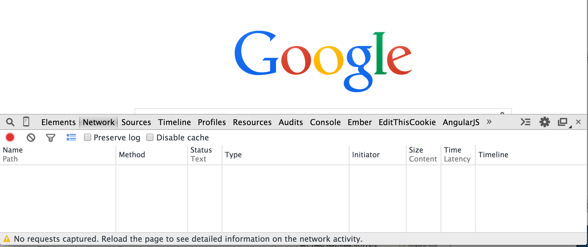

#  AJAX & APIs

| Timing | Type | Topic |
| --- | --- | --- |
| 10 min | [Opening](#opening) | APIs: Introduction |
| 15 min | [Introduction](#introduction1) | HTTP: Recap |
| 30 min | [Demo](#demo) | HTTP |
| 30 min | [Codealong](#codealong) | AJAX and JavaScript |
| 30 min | [Lab](#lab1) | Consumer Finance Data: Independent Practice  |
| 30 min | [Lab](#lab2) | Open Weather Map: Independent Practice |
| 5 min |  [Conclusion](#conclusion)| Final Questions & Exit Tickets |


###  Objectives
*After this lesson, students will be able to:*

- Identify all the HTTP Verbs & their uses.
- Describe APIs and how to make calls and consume API data.
- Access public APIs and get information back.
- Implement an AJAX request with Vanilla JS.
- Implement a Axios AJAX client for a simple REST service.
- Reiterate the benefits of separation of concerns – API vs. Client.

### Preparation
*Before this lesson, students should already be able to:*

- Implement advanced jQuery events.
- Use event delegation to manage dynamic content.
- Use implicit iteration to update elements of a jQuery selection and chaining to place methods on selectors.
- Add a templating language to our projects for better content manipulation.

---

<a name = "opening"></a>
## APIs: Introduction (10 min)

Last class we learned the importance of separation of concerns. It's best practice to separate DOM logic from our data models. This not only allows for cleaner code, but is an easier way to manipulate our layouts and interactions. Separation of concerns becomes ever more important when working with outside data. Let's take a few scenarios where we want to pull data from an external API:

- Twitter client
- Feed reader
- Weather forecasting app
- Social game sharing high scores
- Any app with user log in

Given the increase in the number of devices and platforms, [Service Oriented Architectures (SOA)](https://en.wikipedia.org/wiki/Service-oriented_architecture) have becoming increasingly prevalent and are soon becoming best practice. SOAs allow us to build one backend/database to share across all of these platforms. This means that our applications will not only deal with external APIs, but also rely on these services for our core data.

### API Gotchas

API calls are really a fancy term for making HTTP requests to a server and sending/receiving structured data from that endpoint. We are still communicating with URLs, however instead of receiving markup, like we do with HTML pages, we receive data. If that data is structured as JSON, we can easily start reacting and communicating with it thanks to the provided JSON methods.

Because our pages will be fully or partially rendered on the client side after we receive this data, there are a few best scenarios we need to take into account:

  - Certain APIs require authentication, and we need to provide an API key either as a request parameter, in the header, or in the body of the call.
  - When we make an API call after a user action, we need to give the user feedback that something is happening.
  - We update our view(s) only after we get a return from the server.
  - We need to account for us not receiving data back due to different interruptions/causes:
    - Server timeout
    - Wrong authentication information
    - User loses connection
    - Request URL not found
- [Representational state transfer (REST)](https://en.wikipedia.org/wiki/Representational_state_transfer) is the most common architecture style for passing information to and from these API endpoints.

Before we start consuming these services however, it's important to understand the fundamentals of the underlying communication layer. This communication layer (HTTP) will be responsible for transporting our API calls.

---
<a name = "introduction1"></a>
## HTTP: Recap (15 min)

HTTP is a protocol - a system of rules - that determines how web pages (see:'hypertext') get sent (see:'transferred') from one place to another. Among other things, it defines the format of the messages passed between **HTTP clients** and **HTTP servers**.


Since the web is a service, it works through a combination of **clients which _make_ requests** and **servers (which _receive_ requests)**.

### HTTP Client

**HTTP Clients make or generate HTTP Requests.** Some types of clients are:

* Browsers - Chrome, Firefox and Safari.
* Command Line programs - [curl](http://curl.haxx.se/docs/) and [wget](http://www.gnu.org/software/wget/manual/wget.html).

**HTTP Clients respond to HTTP Responses from a Web Server.** They process the data being returned form a **Web Server, aka HTTP Server.**

### HTTP/Web Server

Two of the most popular **HTTP or Web servers** are [Apache](http://httpd.apache.org/) and [Nginx](http://nginx.com/), But there are lots different [web servers](http://en.wikipedia.org/wiki/Comparison_of_web_server_software) out there. Some web servers are [written in Ruby](https://www.ruby-toolbox.com/categories/web_servers), while others are written in other languages. Of course Javascript can be used as a web server too! [Node JS](https://nodejs.org/en/knowledge/HTTP/servers/how-to-create-a-HTTP-server/)

All **Web Servers** receive **HTTP Requests** and generate **HTTP Responses**. *We'll take a deeper look into these later.*

Often Web Servers are just the middleman, passing HTTP Request and Responses between the client and web application.

### Web Applications

Are programs built by a developer, sometimes using a framework like Rails or Express. These programs plug into a web server, process the **HTTP requests** that the server receives, and generate **HTTP Responses**.


Lost? Here's the play-by-play.

1. A client sends a **HTTP Request** to a **HTTP Server** running on a remote machine.  
  * The **hostname**, given in the URL, indicates which server will receive the request.  
2. The **HTTP server** processes the **HTTP Request**. This may entail passing the request to some **Web Application**, which creates a **HTTP Response**.
3. The response gets sent back to the client.
4. The client processes the response.

**How does the server know what the request is asking for? This is specified by the URL**, a special kind of path that specifies where a **resource** can be found on the web.


> Technically, the term 'resource' refers to an abstraction that your application uses; depending on what the application does. A resource might be a 'Car', a 'Person', a 'User', or an 'Order Cart'. A single resource can be represented in multiple different ways by the server, including a HTML, JSON, PDF files, and images. What we really mean when we say 'resource' above is a specific **representation** of a resource.

---

<a name = "demo"></a>
## HTTP: Demo (30 min)

Lets explore HTTP resources. We'll start by looking at HTTP requests and responses using the Chrome Inspector.


* In Chrome, open up Chrome Inspector (*command + option + 'i', or ctrl + click and select 'inspect element'*).
* Select the Network tab. It should look something like this:



* Next, go to the **URL** https://generalassemb.ly/

  You should be able to see a few HTTP Requests and Responses in the Network tab; for each request you'll see a **Path**, **Method**, **Status**, **Type**, and **Size**, along with info about how long it took to get each of these resources.
  *Most of this information comes from the HTTP Request and Response.*

  * Some HTTP requests are for CSS, JavaScript and images that are referenced by the HTML.
  * Select `generalassemb.ly` in the Path column on the far left.
  * Select the Headers tab. **Headers** are meta-data properties of an HTTP request or response, separate from the body of the message.

### HTTP Request

The first word in the request line, **GET**, is the **HTTP Request's Method**.


**HTTP Request Methods:**   

* **GET** => Retrieve a resource.  
* **POST** => Create a resource.  
* **PATCH** (_or **PUT**, but **PATCH** is recommended_) => Update an existing resource.  
* **DELETE** => Delete a resource.  
* **HEAD** => Retrieve the headers for a resource.

Of these, **GET** and **POST** are the most widely used.

**HTTP Request Structure:**

```
[http request method] [URL] [http version]  
[list of headers]

[request body]
```

*Notice, that the Request Header is separated from the Request Body by a new line.*


**HTTP Request Method Example: (No Body)**

    GET http://vermonster.com HTTP/1.1  
    Accept:text/html,application/xhtml+xml,application/xml;q=0.9,image/webp,*/*;q=0.8  
    Accept-Encoding:gzip,deflate,sdch
    Accept-Language:en-US,en;q=0.8  
    Connection:keep-alive  
    Host:vermonster.com  
    User-Agent:Mozilla/5.0 (Macintosh; Intel Mac OS X 10_8_5)  
    AppleWebKit/537.36 (KHTML, like Gecko) Chrome/32.0.1659.2 Safari/537.36  

### HTTP Response


When a client sends a request, the server sends back a response; the standard format for this response is:

```
[http version] [status] [reason]  
[list of headers]

[response body] # typically HTML, JSON, ...  
```

* HTTP version should be 1.1

**[Status Codes](http://en.wikipedia.org/wiki/List_of_HTTP_status_codes)** have standard meanings; here are a few.

|Code|Reason|
|:---|:-----|
|200| OK
|301| Moved Permanently
|302| Moved Temporarily
|400| Bad Request
|403| Forbidden
|404| Not Found
|500| Internal Server Error


---

<a name = "codealong"></a>
## AJAX and JavaScript: Codealong (30 min)

AJAX stands for Asynchronous JavaScript and XML. It sends and receives information in a variety of formats. The most commonly used format for communicating with APIs, as we've seen, is JSON. AJAX allows us to not only communicate with servers, but it allows us to do this asynchronously, meaning it happens in the background, allow us to update our interfaces and content without refreshing the page.

All modern browsers can use `fetch`, which is a Promise-based API:
```js
fetch('https://pokeapi.co/api/v2/pokemon').then((res) => res.json())
  .then((data) => console.log('data',data));
```

If you need to support a broad array of old browsers, consider using Babel or Typescript to transpile your code. This is a more robust solution than jQuery, which largely solves a problem that no longer exists (cross-browser inconsistencies with the DOM), and does so with a callback style that is no longer idiomatic (everything modern is promise-based and has been that way for years). Babel/Typescript on the other hand allows you to use any cutting edge ES6+ feature you want, whether it's a new browser API, syntax, global function, or method.

See https://developer.mozilla.org/en-US/docs/Web/API/Response for more details on `fetch`.

### Error Handling with fetch

```js
const url = 'https://pokeapi.co/api/v2/pokemon';

// triggers 404
const wrongUrl = 'https://pokeapi.co/api/v2/pokemon2'

const fetchThings = async () => {
  try {
    // fetch the raw response
    const rawResponse = await fetch(url);

    // fetch only rejects for network error or connection issues

    // as a result, we need to handle different scenarios here
    // rawResponse.ok is true if status code is between 200 - 299
    // if (!rawResponse.ok) {
    //   throw new Error(rawResponse);
    // }

    // could also key off status directly
    // if (rawResponse.status === 404) {
    //   throw new Error('Not found');
    // }

    // if we made it this far, we're ok
    // parse response into json
    // see 
    const jsonResponse = await rawResponse.json();

    // now we can do whatever we want with jsonResponse
    // add elements to DOM, make more requests, etc.
  } catch (err) {
    console.log('err', err);
  }
};

fetchThings();
```
#### Other HTTP verbs with fetch

Let's use API here: https://jsonplaceholder.typicode.com/

Here is what the full `fetch` API looks like: 

```js
const response = await fetch(url, {
  method: 'POST', // *GET, POST, PUT, DELETE, etc.
  mode: 'cors', // no-cors, *cors, same-origin
  cache: 'no-cache', // *default, no-cache, reload, force-cache, only-if-cached
  credentials: 'same-origin', // include, *same-origin, omit
  headers: {
    'Content-Type': 'application/json'
    // 'Content-Type': 'application/x-www-form-urlencoded',
  },
  redirect: 'follow', // manual, *follow, error
  referrerPolicy: 'no-referrer', // no-referrer, *no-referrer-when-downgrade, origin, origin-when-cross-origin, same-origin, strict-origin, strict-origin-when-cross-origin, unsafe-url
  body: JSON.stringify(data) // body data type must match "Content-Type" header
});
```

Below is a `POST` example:

```js
fetch('https://jsonplaceholder.typicode.com/posts', {
  method: 'POST',
  body: JSON.stringify({
    title: 'foo',
    body: 'bar',
    userId: 1,
  }),
  headers: {
    'Content-type': 'application/json; charset=UTF-8',
  },
}).then((response) => response.json())
  .then((json) => console.log(json));
```

---

<a name = "lab1"></a>
## Consumer Finance Data: Independent Practice (30 min)

- In the [`ajax_exercise/index.html`](starter-code/ajax_exercise/index.html) file there is a "Get Consumer Finance Data" button. When the user clicks the button, pull data from the provided link above (https://cors-anywhere.herokuapp.com/https://www.consumerfinance.gov/data-research/consumer-complaints/search/api/v1/). Handle the link success and error responses accordingly, displaying results in console.log() if successful.
- Separate your logic so that you can use your functions for another user button click of "Get Custom Data". Interact with an API of your choice and handle both success and error scenarios.
  - A lot of your local cities will have data open to the public with no API keys needed. Give those a try although it does take a bit of Googling. Examples:
    - New York Leading Cause of Death data: `https://data.cityofnewyork.us/api/views/jb7j-dtam/rows.json`
    - Los Angeles Crime data: `https://data.lacity.org/resource/63jg-8b9z.json`
    - Any listed here: https://cfpb.github.io/api/ccdb/api.html
      - but you need to prefix with "https://cors-anywhere.herokuapp.com/"
    - Any listed here: https://jsonplaceholder.typicode.com/guide/

---

<a name = "lab2"></a>
## Open Weather Map: Independent Practice (30 min)

Let's bring it all together. Open the [main.js](starter-code/weather/main.js) file. We will talk with a weather API, and retrieve weather information. Thus far we have worked with just pulling static URLs. Follow the steps below.

  - Sign up for openweathermap.org and generate an API key.
  - User `fetch` to pull weather current data for Washington DC (hint: http://api.openweathermap.org/data/2.5/weather?q=...). Use their [docs](https://openweathermap.org/current) on how to create your request URL
  - Print the temperature in console.
  - Bonus 1: add a form prompting user for the city and state.
  - Bonus 2: convert answer from kelvin to fahrenheit.

---
<a name = "conclusion"></a>
## Conclusion (5 min)

Make sure class objectives have been met:

- Identify all the HTTP Verbs & their uses.
- Implement an AJAX request with Vanilla JS.
- Implement a AJAX client for a simple REST service.

#### Additional Resources

- [Why do we need to call "then" twice on Fetch?][2]
- [MDN Fetch][3]
- [Wikipedia: API][4]
- [What's an HTTP Request?][5]

[2]: https://youtu.be/ZYwrQsBvZtI
[3]: https://developer.mozilla.org/en-US/docs/Web/API/Fetch_API
[4]: https://en.wikipedia.org/wiki/Application_programming_interface
[5]: http://rve.org.uk/dumprequest
