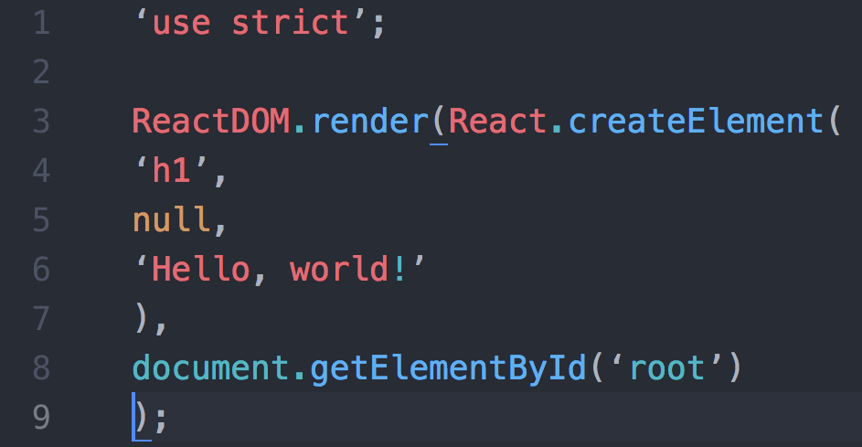

#  Intro to React

## Learning Objectives

* Explain what a frontend framework is and why they can be helpful in writing more complex applications.
* Explain what ReactJS is and where it fits in our applications' stack.
* Explain the component model of web development.
* Create and return React components in the browser.

<a name="opening"></a>
## Intro: What is ReactJS?

React is a JavaScript library used to craft modern day UI and views for the front-end in web applications.

> **Selling Point:** By modeling small compatible components that focus on just rendering a view, we can move business logic out of the DOM, and therefore improve our app's performance, maintainability, modularity and readability.

### Some History

The first thing most people hear about React is "Facebook uses it."
* First used by Facebook in 2011.
* Then Instagram in 2012.
* Went open source in May 2013.

**BEHOLD! The OLD FACEBOOK!** 

*2008*


*2011*


*2020*

 

React was born out of Facebook's frustration with the traditional MVC model and how..
  * Re-rendering something meant re-rendering everything (or just a lot).
  * That had negative implications on processing power and ultimately user experience, which at times became glitchy and laggy.


### React in MVC

React can be thought of as the "Views" layer.

React will work with any back-end language, but for React project and in our in-class examples we will be using Mongoose and Express for the models and controllers.

<details>
  <summary><strong>What is the role of a "view" in a front-end Javascript application?</strong></summary>
  The visual template the user sees, often populated with data from our models.
</details>

## Components

One comment made about React when it was first open sourced was "Rethinking established best practices" which kind of became the React motto.  In React, we want to move away from template pages, away from separating code based purely on file type, and more towards a **component-based** separation of concerns.  [Templates vs Components](https://wanderoak.co/fixed-templates-vs-components/)


> [WanderOak - Fixed Templates vs. Components](https://wanderoak.co/fixed-templates-vs-components/)

When taking a look at Facebook, you could think of each status post as a mini-component in React. And a list of those updates, is a component that contains several of those mini-components. You could take that one step further and think of the Facebook app, as one giant component with several components within it. (Things like the list of status updates, the friends list, the header, etc...)

Imagine you worked at Facebook when they wanted to shift from using likes to reactions. Using traditional JavaScript, HTML, and CSS the shift would make you have to change your code in a bunch of places. Component based architecture allows us to maintain our code more easily.

### Let's together identify the components 


> [MakeTea - Building Robust Apps with React](http://maketea.co.uk/2014/03/05/building-robust-web-apps-with-react-part-1.html)

Notice the structure of how the various components are nested. 
```
- TubeTracker
    - Network
        - Line
    - Predictions
        - DepartureBoard
            - Trains
```

TubeTracker contains the application
Network displays each line on the network
Line displays the stations on a line
Predictions controls the state of the departure board
DepartureBoard displays the current station and platforms
Trains displays the trains due to arrive at a platform

### [F.I.R.S.T. Components](https://addyosmani.com/first/)

A React component is built to expect an input and render a UI with it. More importantly, a well-structured component only receives data specific to its purpose.

This is because React follows a more **functional** approach to programming. For React components under this approach, **the same input will always produce the same output**.

Best practice is that React components follow the **F.I.R.S.T.** guidelines

#### Focused

Components should do one thing and do it well.

#### Independent

Components should increase cohesion and reduce coupling. Behavior in one component should not impact the behavior of another. In other words, components should not rely on one another.

> But they should compliment one another.

#### Reusable

Components should be written in a way that reduces the duplication of code.

#### Small

Ideally, components should be short and condensed.

#### Testable

Because the same input will always produce the same output, components are easily unit testable.

> If you're interested, [Jest](https://facebook.github.io/jest/docs/tutorial-react.html) is a popular testing library for React.


## Exercise: Identifying Components

* Break into groups of three and take a look at Facebook, Craigslist, Ebay, or a website of your choice. Identify the visual "components" the website is comprised of. Write it out or create a diagram with screenshots of the site.

As you're drawing this out, think about the following questions...
* Where do you see "nested components"? Where do you not?
* Are there any components that share the same structure?
* Of these similar components, what is different about them?

----------------------------

## Code Along: Initial Setup

In order to create a new project and to get our development environment setup, we are going to use the Terminal command `create-react-app`. It will create a new folder in your current directory for the in-class application.

`create-react-app` is an NPM package also built by Facebook that writes our build dependencies for us so that we can do less configuration. It allows us to use React, JSX, and ES6. It also allows us to import our CSS, it autoprefixes our CSS so that we don't have to worry about cross browser compatibility, it gives us a dev server to run, and it enables hot reloading which updates the code in our browser without us refreshing the page.

It uses Webpack which is a build tool that enables many of the features listed above. It also includes Babel which transpiles our JavaScript from ES6 to be compatible with older browsers. It also includes Autoprefixer for CSS compatibility, ESLint for linting, and Jest for testing.

You can also set up all this yourself, but for now `create-react-app` allows us to worry more about our code and less about configuration.

```bash
$ npx create-react-app my-app
$ cd my-app
$ npm start
```

> We're using `npx` instead of `npm` here and you might be wondering why. `create-react-app` is updated often and using `npx` ensures that we take advantage of the most recent version. This also allows us to run `create-react-app` without installing anything to our machines!

> Here you will begin setting up a blog app that you will continue working on during this lesson's exercises. For demonstration purposes, We will be creating a simple "hello world" app.

After running `$ npm start`, we can view the app at `http://localhost:3000`

`create-react-app` provides us with all the necessary tools and configuration necessary to start writing React. `npm start` refers to an included script that starts up the development server.

Along with installing the necessary dependencies, it creates an initial app skeleton that looks like this...

```bash
├──README.md
├──  favicon.ico
├──  index.html
├──  node_modules
├──  package.json
└──  src
    ├──  App.css
    ├──  App.js
    ├──  index.css
    ├──  index.js
    └──  logo.svg
```

Most of the important files, which are primarily the ones where we will be working today, are in the `/src` directory.

Take some time and look at what's been generated. Specifically look in `App.js` and `index.js`


### We Do: Hello World - A Very Basic Component

The basic unit you'll be working with in ReactJS is a **component**.

* Components can be thought of as functional elements that take in data and as a result, produce a dynamic UI.

Throughout class we have separated HTML, CSS and Javascript.
* With components, the lines between those three become a bit blurry.
* Instead, we organize our web apps according to small, reusable components that define their own content, presentation and behavior.  

What does a component look like? Let's start with a simple "Hello World" example...

To start, in our `/src/App.js` file, let's remove the contents and in its place add this component definition...

```js
// bring in React from React
import React from 'react'

// define our Hello functional component
function Hello() {
// what should the component return
  return (
  // Make sure to return some UI
    <h1>Hello World!</h1>
  );
}

export default Hello
```

Let's break down the things we see here...

##### `function Hello`
This is the component we're creating. In this example, we are creating a "Hello" functional component.

##### `extends Component`
This is the React library class we inherit from to create our component definition.

##### `return`
Every component has, at minimum, a return. It generates a **Virtual DOM** node that will be added to the actual DOM.
* Looks just like a regular ol' DOM node, but it's not yet attached to the DOM. In this example the return is handling this functionality.

##### `export default Hello`
This exposes the Hello class to other files which import from the App.js file. The `default` keyword means that any import that's name doesn't match a named export will automatically revert to this. Only one default is allowed per file.


## JSX

> Hey you got your html in my javascript!
>
> You got your javascript in my html!
>
> (https://youtu.be/O7oD_oX-Gio?t=5s)

Let's talk about the value that the render method returns. It looks an awful lot like an HTML heading, but it's not. We often write out React components in JSX.

JSX is [a language that compiles to Javascipt](http://blog.yld.io/2015/06/10/getting-started-with-react-and-node-js/#.V8eDk5MrJPN) that allows us to write code that strongly resembles HTML. It is eventually compiled to lightweight JavaScript objects.

Your Hello function:

* Currently returns JSX, not HTML.
The JSX creates a heading with 'Hello World!'.
* Your component reads this and renders a "Hello World!" heading.

> React can be written without JSX. If you want to learn more, [check out this blog post](http://jamesknelson.com/learn-raw-react-no-jsx-flux-es6-webpack/).  

Here is an example of React code without JSX-




## Virtual DOM 

You may have noticed that our `src/index.js` code mentions ReactDOM. ReactDOM doesn't refer to the same DOM we know. Instead, it refers to a Virtual DOM. The Virtual DOM is a key piece of how React works.

The Virtual DOM is a Javascript representation of the actual DOM. The virtual DOM is a staging area for changes that will eventually be implemented.

* Because of that, React can keep track of changes in the actual DOM by comparing different instances of the Virtual DOM.
* React then isolates the changes between old and new instances of the Virtual DOM and then only updates the actual DOM with the necessary changes.
* By only making the "necessary changes," as opposed to re-rendering an entire view altogether, we save up on processing power.
* This is not unlike Git, with which you compare the difference -- or `diff` -- between two commits.


> If you're interested in learning more about the Virtual DOM, [check this video out](https://www.youtube.com/watch?v=-DX3vJiqxm4).

So we've created the template for our component. Now, let's use `/src/index.js` to load in our new component and render it on the DOM...

```js
import React from 'react';
import ReactDOM from 'react-dom';
import './index.css';
import Hello from './App';
import reportWebVitals from './reportWebVitals';

ReactDOM.render(
  <React.StrictMode>
    <Hello />
  </React.StrictMode>,
  document.getElementById('root')
);
```

`ReactDOM.render` takes the Virtual DOM node created by `extends Component` and adds it to the actual DOM. It takes two arguments...

  1. The component.
  2. The DOM element we want to append it to.

> **NOTE:** Whenever you use a self-closing tag in JSX, you **MUST** end it with a `/` like `<Hello />` in the above example.

#### React Strict Mode
StrictMode is a tool for highlighting potential problems in an application. Like Fragment, StrictMode does not render any visible UI. It activates additional checks and warnings for its descendants. For more on Strict Mode, visit React docs: 
https://reactjs.org/docs/strict-mode.html

---
## Hello World: A Little Dynamic

Our `Hello` component isn't too helpful. Let's make it more interesting.
* Rather than simply display "Hello world", let's display a greeting to the user.
* So the question is, how do we feed a name to our `Hello` component without hardcoding it into our render method?

First, we pass in data wherever we are rendering our component, in this case in `src/index.js`...

```js
import React from 'react';
import ReactDOM from 'react-dom';
import './index.css';
import Hello from './App';
import reportWebVitals from './reportWebVitals';

ReactDOM.render(
  <React.StrictMode>
    <Hello name={"Nick"} />
  </React.StrictMode>,
  document.getElementById('root')
);
```

Then in our component definition in our `src/App.js`, we have a reference to that data via as a property on the `props` object...

```js
function Hello(props) {
  return (
      <h1>Hello {props.name}</h1>
  );
}
```

In the above example, we replaced "world" with `{props.name}`.

### What are `.props`?

Properties! Every component has `.props`
* Properties are immutable. That is, they cannot be changed while your program is running.
* We define properties in development and pass them in as attributes to the JSX element in our `.render` method.

First we can pass multiple properties to our component when its rendered in `src/index.js`..

```js
import React from 'react';
import ReactDOM from 'react-dom'
import Hello from './App.js'

ReactDOM.render(
  <Hello name={"Nick"} age={24} />,
  document.getElementById('root')
)
```

Then in our component definition we have access to both values...

```js
function Hello(props) {
  return (
    <div>
      <h1>Hello {props.name}</h1>
      <p>You are {props.age} years old</p>
    </div>
  );
}
```

> **NOTE:** The return statement in `render` can only return one DOM element. You can, however, place multiple elements within a parent DOM element, like we do in the above example with `<div>`.

---

## Practice: A Blog Post 

Let's have some practice creating a React component from scratch. How about a blog post?
* Create a `post` object literal in `src/index.js` above `ReactDOM.render()` that has the below properties.
  1. `title`
  2. `author`
  3. `body`
  4. `comments` (array of strings)
* Render these properties using a Post component.
* The composition of your Post is up to you.

If you finish early, try experimenting with CSS (Make Sure you use `className` instead of `class` in `JSX`!)


<details><summary>Solution</summary>

*Post.js*

```js
import React from 'react';

function Post(props) {
	return(
        <div>
            <h1>{props.title}</h1>
            <p>By {props.author}</p>
            <div>
                <p>{props.body}</p>
            </div>
            <h3>Comments:</h3>    
            <p>{props.comments[0]}</p>
        </div>
    )
}

export default Post;
```

*index.js*

```js
import Post from './components/Post';

const post = {
    title: "Avengers",
    author: "Nick Fury",
    body: "I secretly recruited a group of superheroes to save our world.",
    comments: [
      "I love Avengers.",
      "Forget Avengers, we want the Witcher.",
		"At least let aliens destroy D&D for what they did to GOT!"
    ]
}

ReactDOM.render(
    <Post 
        title={post.title} 
        author={post.author}
        body={post.body} 
        comments={post.comments}/>, 
    document.getElementById('root')
);
```

</details>


---


#### Q: What problems did you encounter when trying to add multiple comments to your Post?

It would be a pain to have to explicitly define every comment inside of `<Post />`, especially if each comment itself had multiple properties.
* This problem is a tell tale sign that our separation of concerns is being stretched, and it's time to break things into a new component.

We can nest a Comment component within a Post component.
* We create these comments the same way we did with posts
* Then we can reference a comment using `<Comment />` inside of Post's return method.

Let's create a new file for our Comment component, `src/components/Comment.js`...

```js
import React from 'react';

const Comment = (props) => {
    return(
        <div>
            <p>{props.message}</p>
        </div>
    )
}

export default Comment;
```

Then in `src/components/Post.js`, we need to load in our `Comment` component and render it inside of our `Post` component...

```js
import React from 'react';
// Load in Comment component
import Comment from './Comment'


function Post(props) {
	return (
	  <div>
	    <h1>{props.title}</h1>
	    <p>By {props.author}</p>
	    <div>
	      <p>{props.body}</p>
	    </div>
	    <h3>Comments:</h3>
	    // Render Comment component, passing in data
	    <Comment message={props.comments[0]} />
	  </div>
	);
}

export default Post;
```

> **Note**: We could put all of our code in one file, but it's considered a good practice to break components out into different files to help practice separation of concerns. The only downside is we have to be extra conscious of remembering to **export / import** each component to where it's rendered.

The above code works, but we'd have to hard-code all of our `Comments`.  This is not very dry and our code will not dynamically change.  The best way to handle this is to set a variable equal to all of the `<Comments />` for this post.  We can do this using `.map` in `Post` function.

We can use `.map` in `Post` function to avoid having to hard-code all of our `Comments`

```js
import React from 'react';
import Comment from './Comment';

function Post(props) {
    let comments = props.comments.map((comment, index) => (
        <Comment message={comment} key={index}/>
    ))

    return(
        <div>
            <h1>{props.title}</h1>
            <p>By {props.author}</p>
            <div>
                <p>{props.body}</p>
            </div>
            <h3>Comments:</h3>    
            {comments}
        </div>
    )
}

export default Post;
```

---

## Conclusion

* Why do we use components in React?
* What is the Virtual DOM?
* What is JSX?
* What features does `create-react-app` give us?

---

# State and Data-flow

## Learning Objectives

* Review passing data to a React component via `props`.
* Define and use nested components.
* Identify `state` in a React app.
* Modify the `state` of a React component through events.
* Distinguish container and presentational components.

## Framing

In this lesson we will be looking at how data is managed within a React application. In particular, we will compare and contrast a component's `props` and `state`. They are similar, but have a couple key distinctions:

* `props` are passed into a component, but `state` is local or native to the component
* While we cannot change `props` (immutable) from within a component, we can change a component's `state` (mutable).

## State

The limitation of props is that they are immutable; we can't change the data from within the component. The data that we can change within a component is called **[state](https://facebook.github.io/react/docs/state-and-lifecycle.html)**. 

We haven't talked about state much, but you have worked with it before. Think back to your game project. How did you track the score of the game, the current turn, whether or not the game had ended or not. These are all examples of state.

* **Trivia**: what is the current score, what card is currently displayed to the user, is the user's input correct or incorrect?
* **Simon**: what order of buttons did the user push, what is the order of buttons they were supposed to push, what round or level are they on?
* **Blackjack**: what is the score of the player's hand? The dealer's? How do we award money to a winning hand?

We can figure out the `state` of a turn-based game because there is a clear idea of a beginning and end and states that reflect progress from one turn to the next turn: what flash card is the user on, what buttons do they need to push, how the cards are distributed among the two players.


*Q: So we know an application can have different states. But how do we transition in between them?*

Events! (or user actions)


### F.I.R.S.T. Principles and State

The aim of the F.I.R.S.T. principles is to create a sane approach to breaking down not just a user interface, but also an application's data. Following the F.I.R.S.T principles should lead you to manageable, focused components that work with a specific set of data: the **props** we pass to those components and the **state** of the component itself.

*Each component is concerned only with the data relevant to its purpose*.

For your first project, you had to do that manually. Manually write event listeners that would update state stored in global scope and then update your UI by manually updating individual DOM nodes.

You can think of React as an event-driven state machine, in other words, a react app churns out new states as a result of user interactions. 

A React application receives input through user interactions (event listeners) and outputs a UI that reflects a brand new state (new cards, fewer or more chips, etc).


 *Q: What do we mean by a React component's "state"?*

The object properties of a component (`state`) that change as the application runs, as opposed to `props`, which are immutable.


### State and Rendering

Before moving on to build our application, it's worth mentioning another aspect of `state`: when it changes our components re-render.


Our UI updates when state changes. The user takes some action, like submitting information via a form, and the component holding that form has a `state` that is updated with the value of the user's input.

### Props vs State

Just a recap, both **props** and **state** are plain JS objects that hold information, but when updated re-renders the component. However they are different in one important way, `props` get passed to the component whereas `state` is managed within a component.

## Let's build something together.

Together we are going to grow our blog application with state and props! Yay!

Start by cloning this repo, then follow these instructions:

```bash
cd <FOLDER NAME>
npm install
npm start
```
You should be greeted with a Hello message. 

Now let's install a handy tool.
1. Chrome: [React Dev Tools](https://chrome.google.com/webstore/detail/react-developer-tools/fmkadmapgofadopljbjfkapdkoienihi?hl=en)
2. Firefox: [React Dev Tools](https://addons.mozilla.org/en-US/firefox/addon/react-devtools/)

At the moment we will see our `Hello` component inside of google chrome's development tools under the React tab. (We can even see our props/state!)

Awesome! Now update `index.js` to render out the Post component.

```js
import React from 'react';
import ReactDOM from 'react-dom';
import './index.css';
import Post from './components/Post';

const post = {
    title: "Avengers",
    author: "Nick Fury",
    body: "I secretly recruited a group of superheroes to save our world.",
    comments: [
      "I love Avengers.",
      "Forget Avengers, we want the Witcher.",
      "At least let aliens destroy D&D for what they did to GOT!"
    ]
}

ReactDOM.render(
    <Post 
        title={post.title} 
        author={post.author}
        body={post.body} 
        comments={post.comments}/>, 
    document.getElementById('root')
);

```

As you can see we are rendering a Post component with the props that we defined earlier.

So far we have used props to pass information from one component to another. But, what if we wanted data to change within a component? Props are immutable and as such can't be changed while the app is running. Time for `state`!

Unfortunately, introducing `state` means exposing the limitations of our functional components and learning about a new syntax for defining components called "Class-based components".

However easy *functional components* are to read, debug or test but they do not have state or lifecycle methods. Class-based components do. Both of these new concepts (state, and lifecycle methods) are important in React development, which is why we need to learn how to write a class component.

### Functional vs Class Component

#### Syntax
One of the obvious differences between these types of components is the syntax.

Functional components, as the name implies, are just like a regular js function with access to a `props` argument.

```
import React from 'react';

function Welcome(props) {
  return <h1>Hello, {props.name}</h1>;
}
```

Class components, again as the name implies, are written in JS class syntax and inherits properties and a lot of functionality from `React.Component`.

```
import React from 'react';

class Welcome extends React.Component {
  render() {
    return <h1>Hello, {this.props.name}</h1>;
  }
}
```

Notice the use of `this` to call the property name. Why do we have to use the `this` keyword here?

#### State

Functional components are **stateless** that means they don't have access to state. 

Class components are **stateful**, state can be accessed and updated.

> Technically, this has changed post React 16.8 release. We now have something called "hooks" for changing the state in a functional component. But for simplicity sake we will say that state cannot be changed in functional component.

#### Lifecycle Methods

Another feature that cannot be used in functional components are "lifecycle methods". Lifecycle methods run at specific times in the rendering, mounting, and unmounting phases of a component's life. Functional components don't have access to these methods for the same reason that they don't have access to state: all lifecycle methods are inherited from `React.Component` through the extend syntax.

So,if you need lifecycle methods you need a class component.

> This has also changed post React 16.8 hooks update.

### Code Along: Adding a state object

We're going to add "Karma" to our comments in order to show the user which comments are positive and which are negative by changing their colour.

We need a class-based component to add and access state. Let's first change the syntax of our functional `Comment` component to the Class-based alternative.

```js
import React, {Component} from 'react'

class Comment extends Component {

}

export default Comment
```

Since this is a class, instead of adding a `return` (which is not possible), we will use `render()` to return JSX when this component is invoked.

```js
import React, {Component} from 'react'

class Comment extends Component {
  render () {
    return (
      <div>
	      <p>{this.props.message}</p>
      </div>
    )
  }
}

export default Comment
```

> `this` keyword is used to access `message` property sent from `Post`

Let's set state inside of our comments. And we will use the `karma` state to set class name in `div`

```js
import React, {Component} from 'react'

class Comment extends Component {
  state = {
    karma: 'good'
  };

  render () {
    return (
      <div className={this.state.karma}>
        <p>{this.props.message}</p>
      </div>
    )
  }
}

export default Comment
```

As you can see `state` is an object with key-value pair.

Inside our React Developer Tools we will now see that by default we have set the state of karma to 'good' for all comments. We also used this state to declare a classname attached to our comment component. Now that we have a set state we can now create a method built into our component to update the state.

We will be creating a `changeKarma` method to update our `state` and a button that will call trigger that update by calling the new method. Simply put, the function checks the state and toggles it depending on the current value. While we're at it, let's add some gifs.

```js
import React, {Component} from 'react'

class Comment extends Component {
  state = {
    karma: 'good'
  };

  changeKarma = () => {
    if (this.state.karma === 'good'){
      this.setState({
        karma: 'bad'
      })
    } else {
      this.setState({
        karma: 'good'
      })
    }
  }

  render () {
    let goodKarmaSrc = "https://media.giphy.com/media/1zJFtdNUhblPRT1yQy/giphy.gif";
    let badKarmaSrc = "https://media.giphy.com/media/AxVvk4TmDfmoMtSmmQ/giphy.gif";
    
    return (
      <div className={this.state.karma}>
        
        <p>{this.props.message}</p>
        <button className={"button"} onClick={this.changeKarma}>Change Karma</button>
      </div>
    )
  }
}

export default Comment
```

> Notice the use of ternary operator to change the gif in the `img` tag

So onClick the button will run the method changeKarma. 

Even though our `className` is changing on click of the button, nothing really is happens on the screen. So let's add a bit of styling in `index.css` to see some changes.

```
.good,
.bad {
  padding: 20px;
}

.good img {
  border: 5px solid green;
  width: 200px;
}

.bad img {
  border: 5px solid red;
  width: 200px;
}
```


Amazing!  Now when we click on our button the class attached to the component is switched without having to refresh the page. 


## Check for Understanding

* What is the difference between `state` and `props`?
* What do we use `props` for?
* What do we use `state` for?

We've done a fair amount of framing so far, so let's practice with another application: React Counters!


## Closing 

If asked, could you explain the differences between props and state? If not, reread this lesson and build out another Counters app, repitition is the key to understanding React. We've now covered the differences between the two as well as how you can use state to control data inside a component and how to update state to display new data to a user.

Defining components and working with props and state (data) constitutes the majority of the work of building a React application.

## Bonus

### Style in React

When it comes to adding styles to React, there is a bit of debate over what's the best practice. Facebook's official docs and recommendations are to write stylesheets that treat your CSS rule declarations as properties on one big Javascript object that can be passed into components via inline styles.

From the [Docs](https://facebook.github.io/react/tips/inline-styles.html)...

>  "In React, inline styles are not specified as a string. Instead they are specified with an object whose key is the camelCased version of the style name, and whose value is the style's value, usually a string"

However, this kind of rethinking the wheel feels like a step backwards for a lot of designers and developers who cringe at the notion of inline styles. For them, they choose to build React apps through a more traditional flow of adding ids and classes and then targeting elements via external stylesheets.

Also, via Webpack and other custom loaders, it is possible to use many third-party libraries or processors such as SASS, LESS, and Post-CSS.

Interesting to note, this problem has not been universally solved, and thus the debate will most likely continue to rage on until somebody figures it out. Therefore, its often left to a team decision when choosing the best option for the application.

Interested in learning more? Check out some excellent blog posts on the subject from the front-end community:
- https://medium.com/@jviereck/modularise-css-the-react-way-1e817b317b04#.61qgjgdu3
- http://jamesknelson.com/why-you-shouldnt-style-with-javascript/
- http://stackoverflow.com/questions/26882177/react-js-inline-style-best-practices
- https://css-tricks.com/the-debate-around-do-we-even-need-css-anymore/

### [Example of Object Literal Styles with React](https://github.com/ga-wdi-exercises/react-omdb/commit/830697fc68dcdccafcae9f73e711103de8d93fc9)

> **Reminder**: `class` is a protected keyword in React, in order to add a class attribute to an element use the keyword `className`

To add the finishing touches to our application, let's take a stab at styling our app with inline-styles and advance our markup with some help from Bootstrap...
- Load in Bootstrap CDN in `index.html`
- Modify UI to include Bootstrap classes
- Create a `styles` directory and make a file for your CSS rule definitions - this will be written in Javascript!
- Load in that file in any component and then use that to apply inline styling

### Resources

* [Imperative vs. Declarative Javascript](http://www.tysoncadenhead.com/blog/the-state-of-javascript-a-shift-from-imperative-to-declarative#.VxgGxZMrKfQ)
* [Styling in React](http://survivejs.com/webpack_react/styling_react/)
* [ReactJS Fundamentals Course](http://courses.reactjsprogram.com/courses/reactjsfundamentals)